# Home
 
 
 
 
 

## _Screenshot - 1_

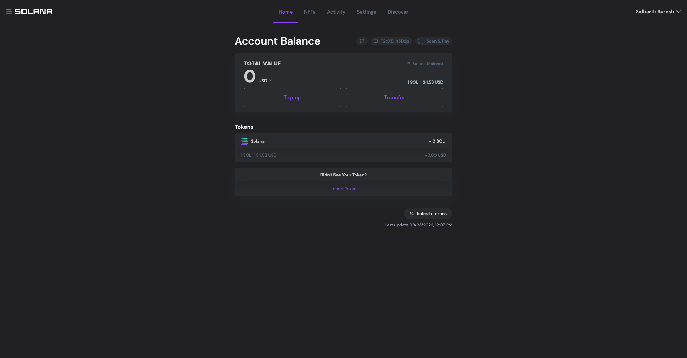
 
 

>While running this repo locally user will be able to access the above landing page (screenshot - 1) of Solana Wallet at [http://localhost:8080/wallet/home](http://localhost:8080/wallet/home) .

---------------------------------------------------------------------------------------------------

 
 

## _Account Balance_

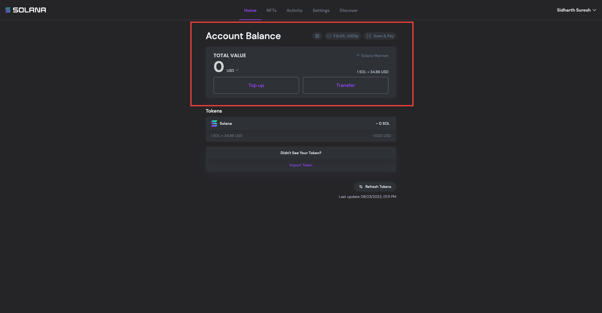
 
 

>Account Balance section shows the cumulative account balance of user in the wallet. It also displays the current value of one SOL token. There is a drop down menu to change the currency type (13 supported currencies) and default is USD.

---------------------------------------------------------------------------------------------------

 
 

## _Share Address / QR code_

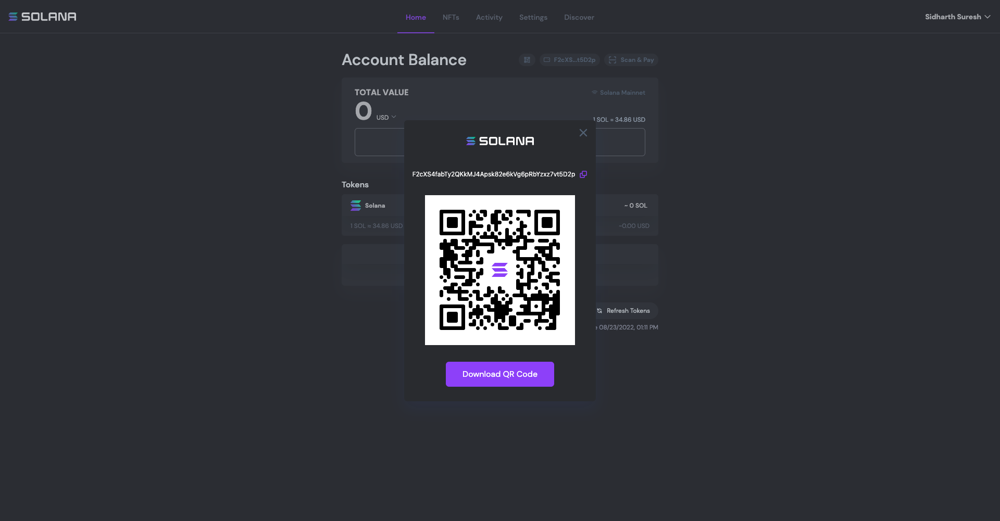
 
 

>Clicking the QR code icon on the home page will trigger a popup with a QR code embedded with the wallet address,there is also an option to download
the QR code or one click copy the public address. User can share the QR Code or public address with anyone to receive SOL tokens or NFT's on this wallet.
(Anyone with the public address can see your wallet balance and previous transactions).

---------------------------------------------------------------------------------------------------

 
 

## _Scan & Pay_

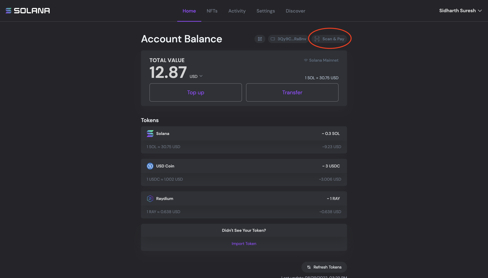
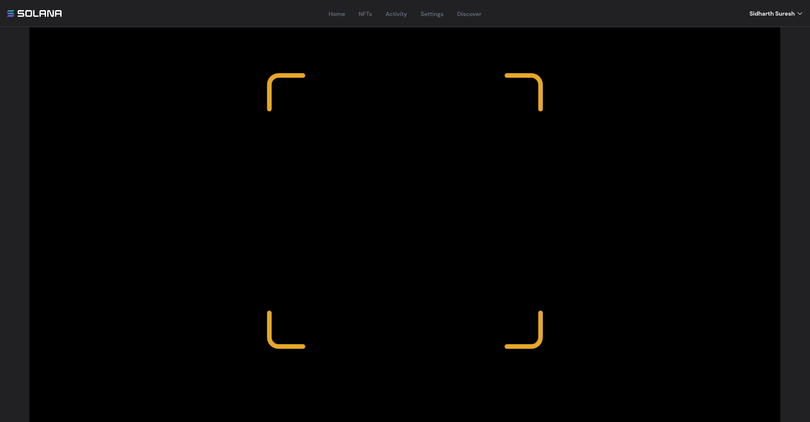
 
 

>Scan & Pay button on top lets the user harness [Solana Pay](https://solanapay.com/), which is an decentralized and performant payment network for immediate transactions in USDC or Solana-based stablecoins. Solana Pay is energy efficient and fast and its the first open direct merchant-to-consumer payment rail.

>Scan & Pay opens the device camera to scan merchants QR Code.

>Interested to know more about Solana Pay? [How Solana Pay works](https://solana.com/news/solana-pay-transaction-requests-bring-on-chain-interactivity-to-the-off-chain-world)
---------------------------------------------------------------------------------------------------

 
 

## _Buying SOL Tokens_

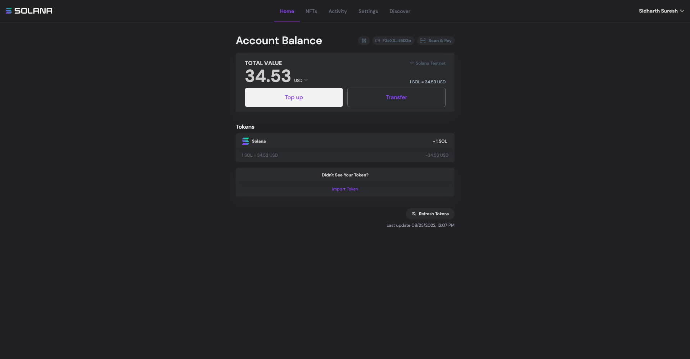

 
 

>Solana wallet allow users to purchase SOL tokens directly from the wallet.
- Clicking on the topup button takes user to a page to select the service provider to buy tokens from.
- Currently users can purchase and topup SOL tokens from [Moonpay](https://www.moonpay.com/) only.
- User can select the topup value in user's preferred fiat currency and the wallet will redirect user to moonpay website to complete the payment.
- On completing the payment user will receive equivalent SOL tokens (after moonpay commisions) in user's wallet.
---------------------------------------------------------------------------------------------------

 
 

## _Transfer Button_

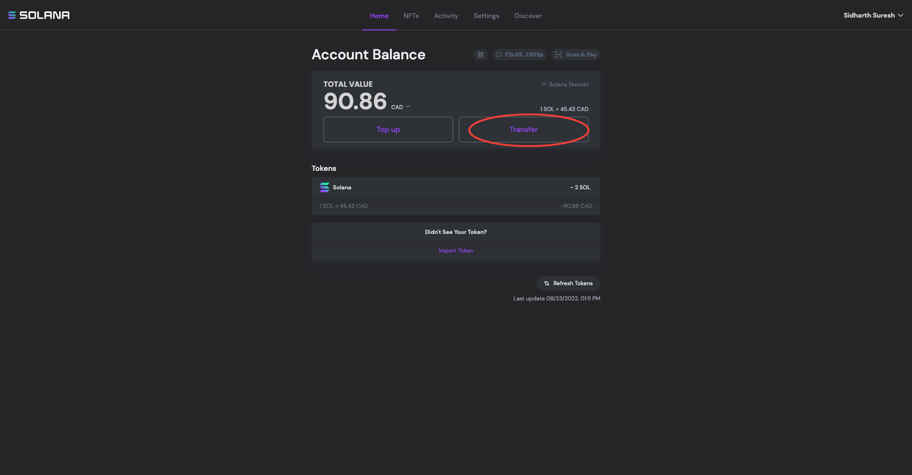
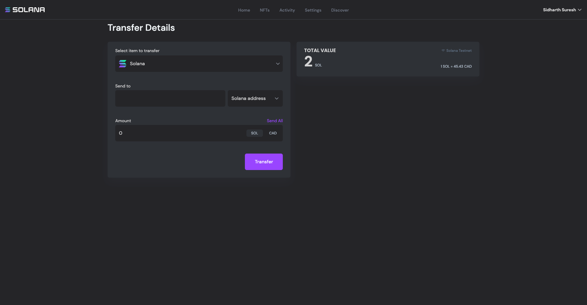
 
 
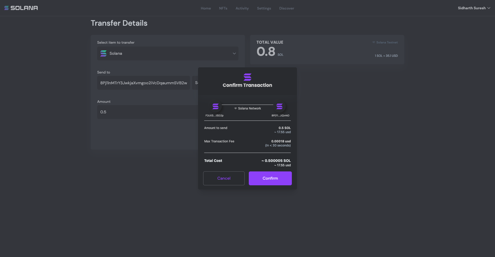
 
 

>Transfer Button on the wallet redirects user to a transfer page to send SOL tokens or NFT tokens to other Solana addresses.
- Make sure a valid Solana address/SOL Domain is provided (eg: transferring SOL to ETH or BTC address will result in permanent loss of tokens)
- There is a dropdown menu to select the token.
- For sending SOL tokens user can set the transfer amount in SOL tokens or in user's preferred currency of choice.
- User can select the topup value in his/her preferred fiat currency and the wallet will redirect user to moonpay website to complete the payment.
- Confirm Transaction popup will show the glimpse of the sending and receiving addresses and shows the maximum transaction fee possible for the transfer.

---------------------------------------------------------------------------------------------------
 
 

## _Tokens_

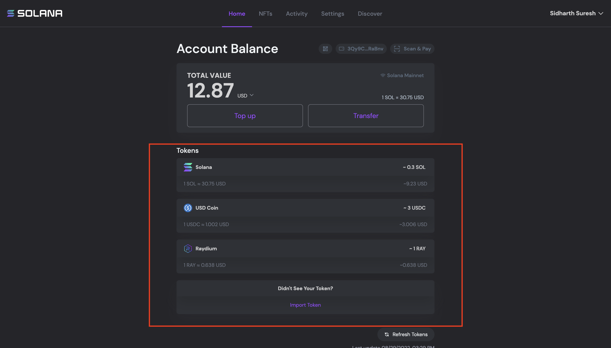
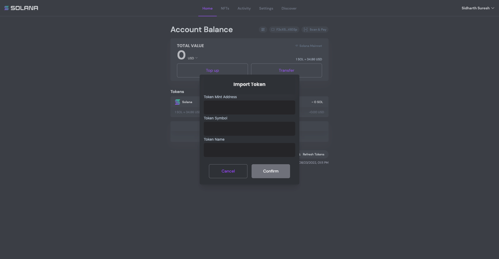
 
 

>Tokens section in the wallet lists the available tokens in the wallet.

- By default SOL token is listed here and corresponding number of tokens is also shown.
- Solana Wallet can also display tokens belonging to the user which are minted using [SPL](https://spl.solana.com/).
- User can click on Import Token button and fill in the details to import SPL tokens owned by the public address.

---------------------------------------------------------------------------------------------------
 
 

## _Logout or Choose different Address_

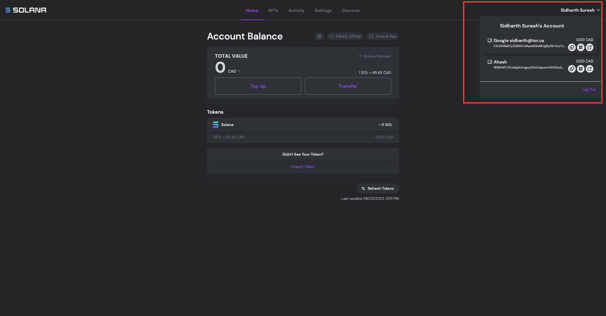

 
 

>User can click on their username on top right corner of the screen to logout or choose an alternate wallet address.
