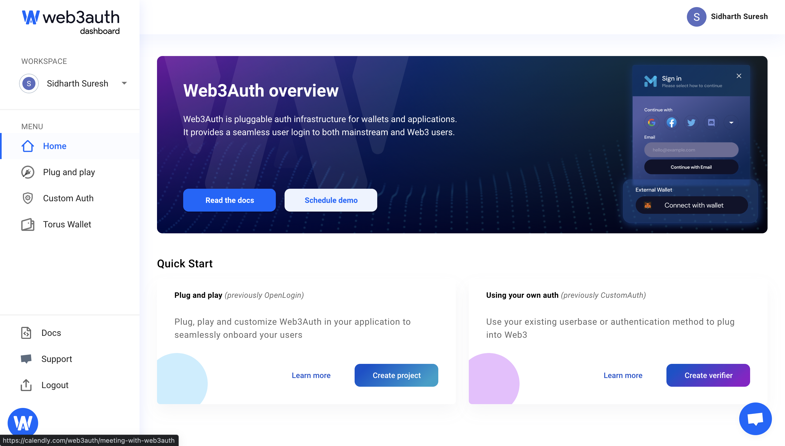
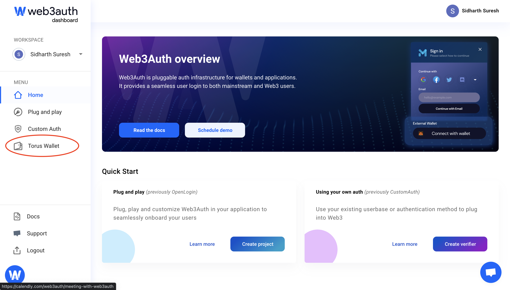
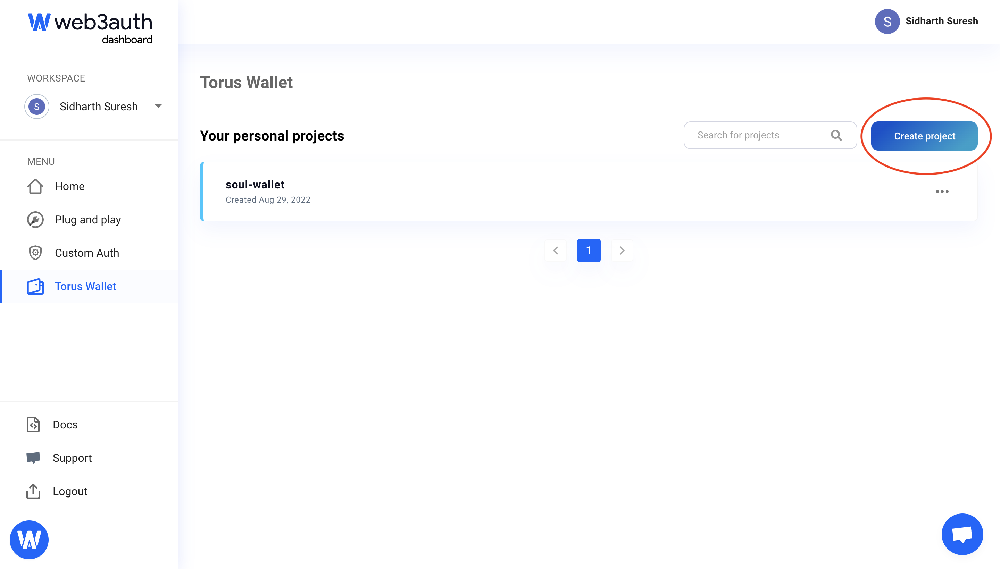
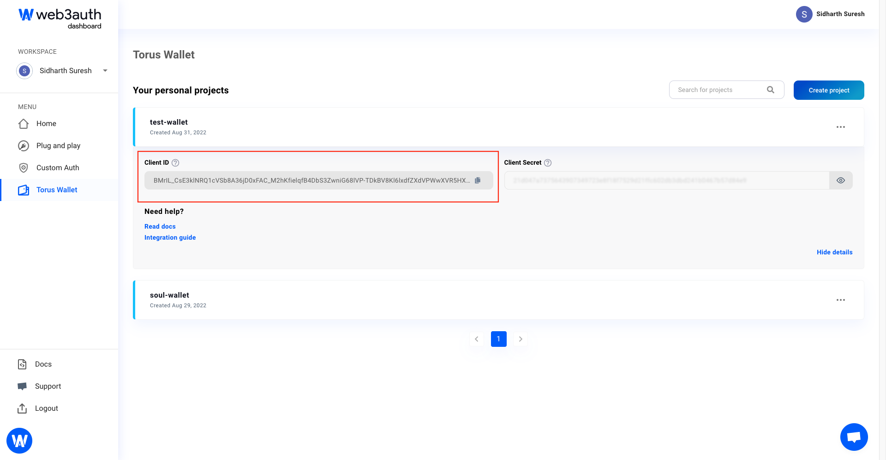

# Generating clientId for your fork from Web3Auth Dashboard

You can login to Web3Auth dashboard [here](https://dashboard.web3auth.io/).

Click on the Torus Wallet button on left side.

 Click on create a new project button to start a new project and generate a Client ID which you can copy and use in your project.
