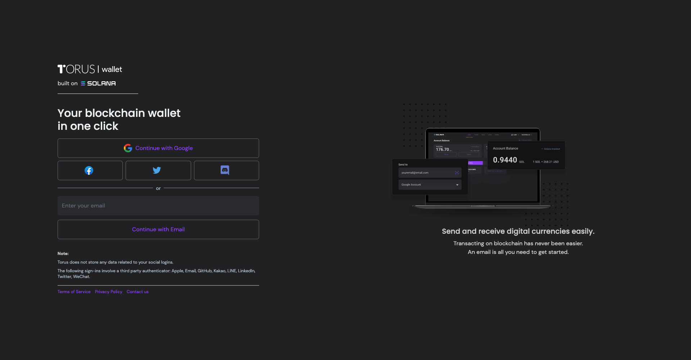

# Login
 
 
 
 
 

You can login to Solana Wallet at [Production URL](https://solana-testing.tor.us/login).
 
 
To login to your local deployment at : [Local Version](http://localhost:8080/login).

 
 

>Solana Wallet has one click login with your Google account / Facebook / Twitter / Discord.
>Users can also login with their email id and validating a link via email.

 
 

>Things to remember:

- Torus does not store any data related to your social logins.
- The following sign-ins involve a third party authenticator: Apple, Email, GitHub, Kakao, LINE, LinkedIn, Twitter, WeChat.
---------------------------------------------------------------------------------------------------

 
 
