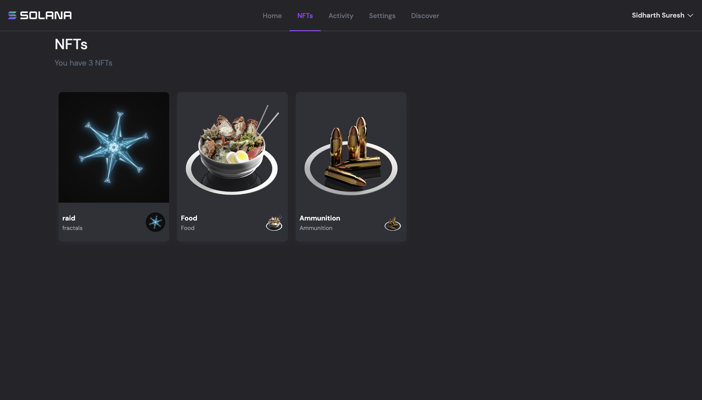
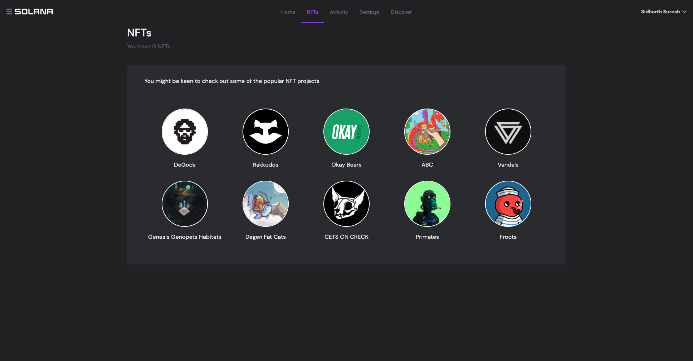
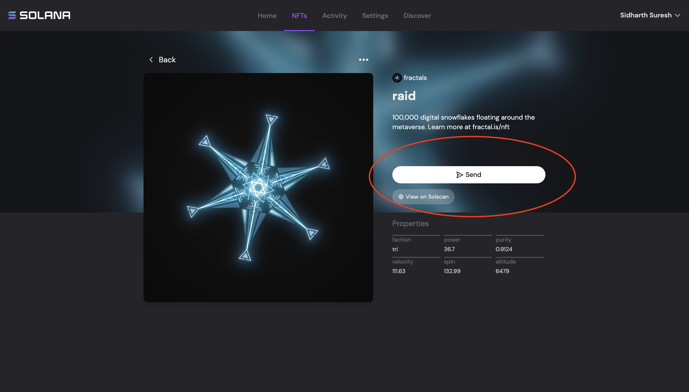
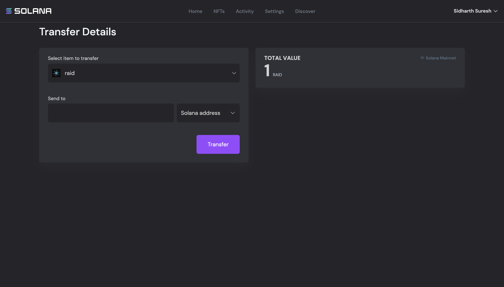
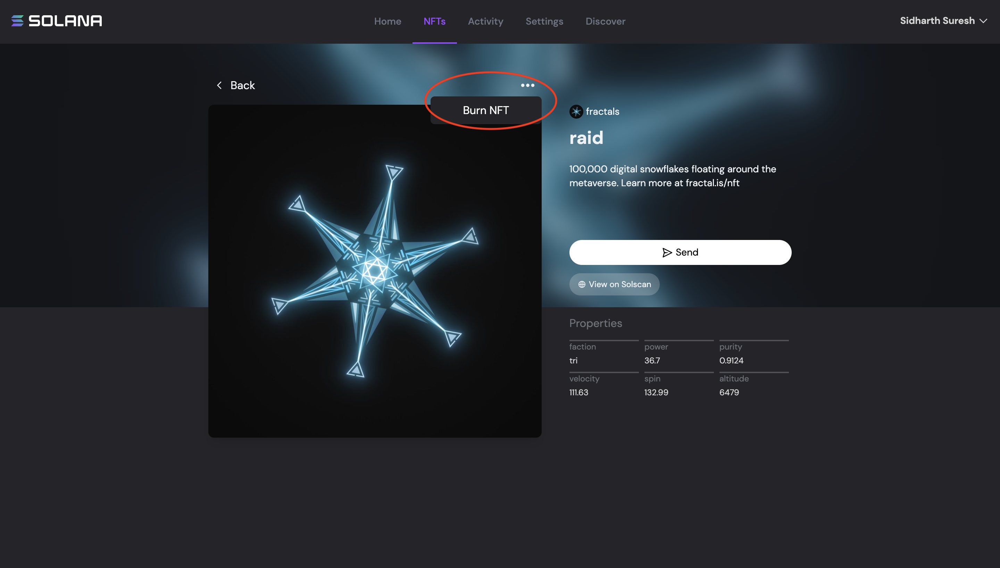

# NFTs

Popular NFT projects are listed in this page and users are redirected to [MAGIC EDEN](https://magiceden.io/) .

If user don't own any NFT's wallet will display popular NFT projects from which user can buy them.

Users can click on the nft icon to open a detailed view of the asset and the detailed page allows transfer and burning NFT.

NFT can be transferred to any other valid solana address via the transfer page.

Burning NFT's will free up the resources and the sol tokens are returned to the user's wallet.

---------------------------------------------------------------------------------------------------
