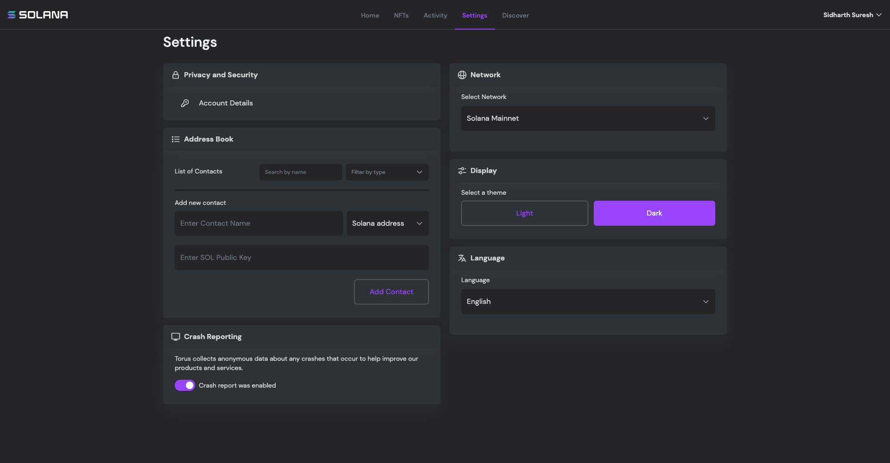
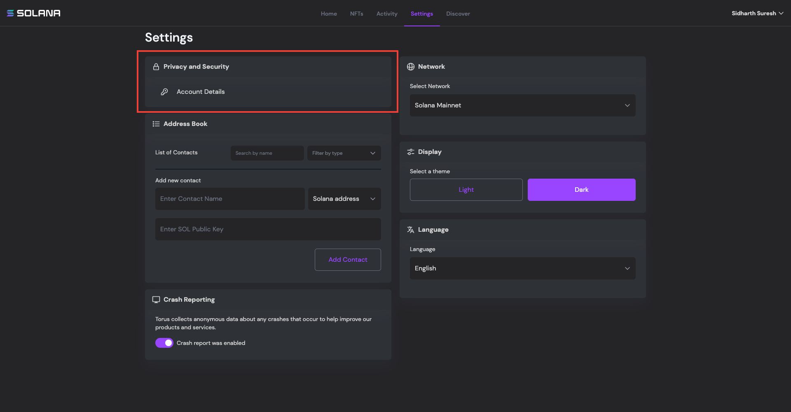
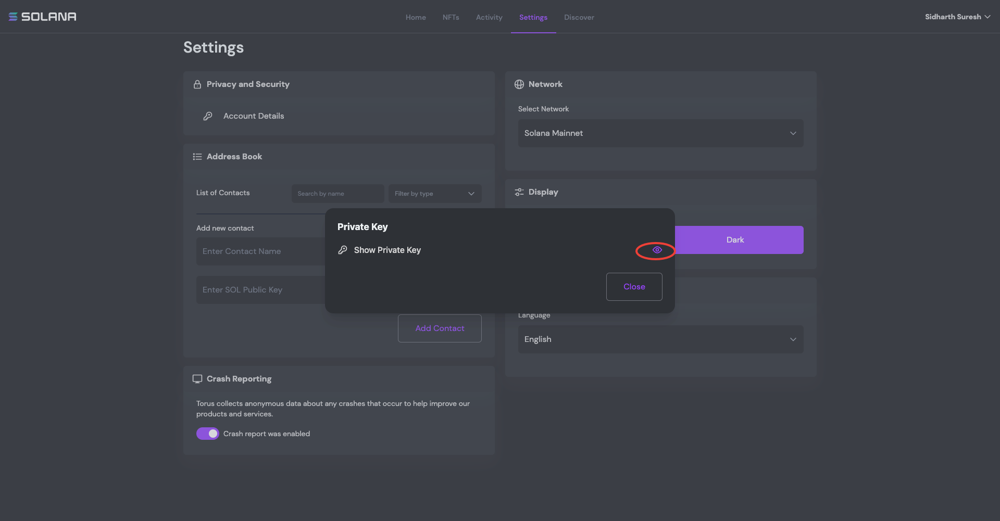
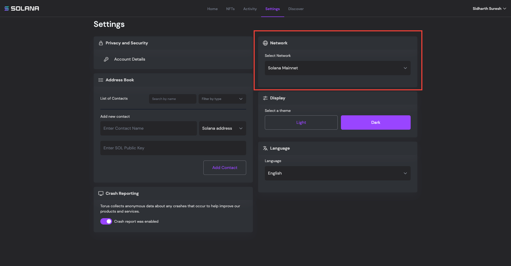
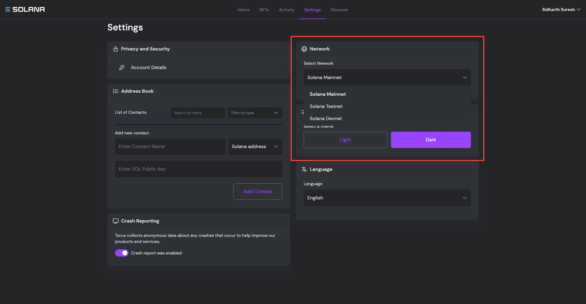
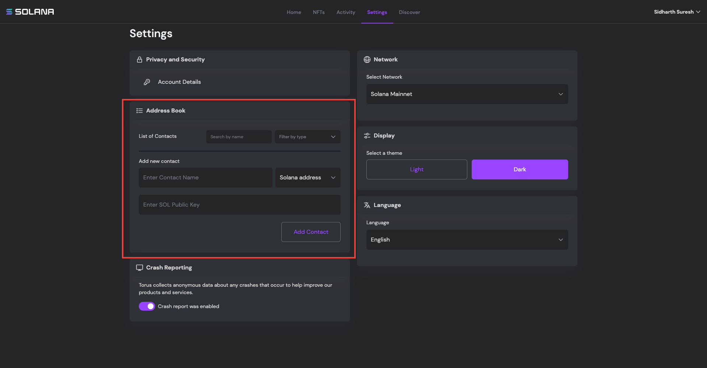
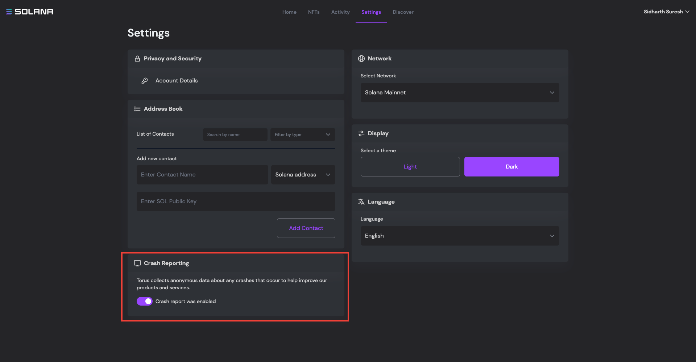
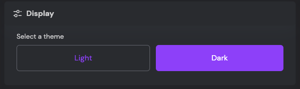
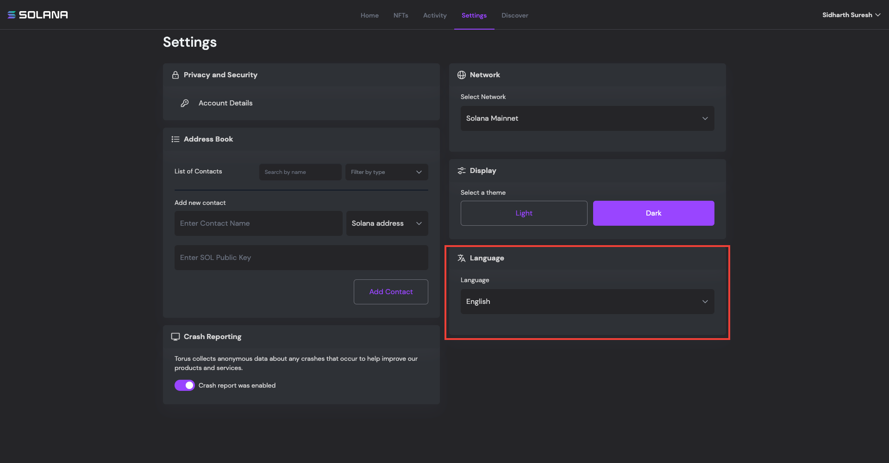

# Settings
 
 
 
 
 

> Settings page is Solana Wallet allow users to tweak settings of the wallet according to their preferences. Below are the current tweaks available in settings page.

 
 

## _Privacy and Security_

 
 

> Privacy and Security tab allow user to view and copy the private key from the wallet. Don't this feature if you are new to blockchain and crypto universe and also try not to use this feature while you are screensharing / screenrecording.

---------------------------------------------------------------------------------------------------

 
 

## _Network_

 
 

> Network tab let user choose the solana network the user wants to connect the wallet to. User can opt between Solana Mainnet, Solana Testnet and Solana Devnet. Same public key is used to interact with all 3 networks.

> Keep in mind that the SOL tokens you receive in Devnet and Testnet are worthless and they cannot be converted into fiat currencies instead they are just for testing purpose.

---------------------------------------------------------------------------------------------------

 
 

## _Address Book_

 
 

>Solana Wallet let users store contact information in the wallet and use it at the time of sending transactions.

---------------------------------------------------------------------------------------------------

 
 

## _Crash Reporting_

 
 

>Enabling crash reporting will help us improve the performance and reliability of Solana Wallet. You can disable it if you want.

---------------------------------------------------------------------------------------------------

 
 

## _Display and Language tabs_

 
 

>Enabling crash reporting will help us improve the performance and reliability of Solana Wallet. You can disable it if you want.

---------------------------------------------------------------------------------------------------
